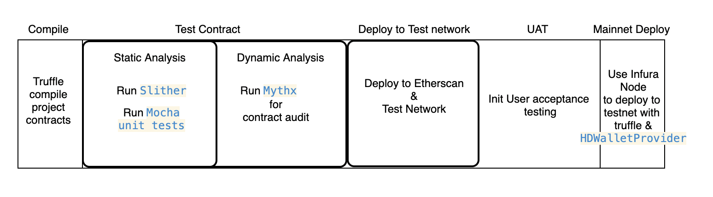

<!-- @format -->

# Tokenization Standards

Token fit inits with contract standards for the ERC20 token interfaces from Openzeppelin.

The project contains boiler plate for a complete DApp over React, Web3 and Solidity smart contracts. For contract bundling and deployments we use truffle configuration to deploy contracts to any public network specified into truffle-config.js.

To Verify/Publish on Etherscan we will use Truffle verify plugin and contract functions will be available for testing over Etherscan website.

Demo: Contract on Ropsten Network [Etherscan](https://ropsten.etherscan.io/token/0xBD268AD65620B697d46D7d5b8DEEC93228af1b12)

Note: A different infura projectId for each network is required as well as an Etherscan API key. Keys are personal and must not be commited to git, store on .env file.

# Prerequisites

- Node v14.17.0
- Truffle v5.3.1
- Infura Project Key
- Etherscan API Key

# Local development

- Install
  ```console
  npm i
  ```
- Compile contracts

  ```console
  truffle compile
  ```

- Testing - deploying contracts to local blockchain Ganache

  ```console
  ganache-cli  -p 8545
  ```

- Configuration for Ropsten network

  - truffle-config.js

  ```console
  networks:
      ropsten: {
           provider: () => new HDWalletProvider(METAMASK_KEY,
           "https://ropsten.infura.io/v3/" + INFURA_PROJECT_KEY),
           network_id: 3,       // Ropsten's id
  }
  ```

- Dependencies

  - Infura (light node client) project Key [https://infura.io/]
  - Etherscan API Key for publishing

- How to run tests
  ```console
  - Run `truffle test` to run contract testing with MochaJs
  ```

## Testing & Deployment Pipeline

- Deployment instructions

  - Ensure contract compilation one by one with
    - `solc <path/contractName>`
  - Run Static Analysis `slither
    - `<path/contractName>`
  - Run Dynamc Analysis
    - (Upload contract to Mythx site for a complete audit analysis)
  - Migrate to Test Network with
    - `truffle migrate --network <networkName> --reset`
  - Upload to Etherscan
    - `truffle run verify TokenBCA --network ropsten --debug`
  - Perform UAT manual testing
  - Deploy to Mainnet with
    - `truffle migrate --network mainnet`

  

## Contract Specifications

- Standard Openzepelling contract
- Refer to [this](https://kalis.me/verify-truffle-smart-contracts-etherscan/) article.

## Etherscan verification

- Publish contract interface to etherscan
  `truffle run verify TokenBCA --network ropsten --debug`

## TODO

    - Set configuration to deploy on Optimism Network
